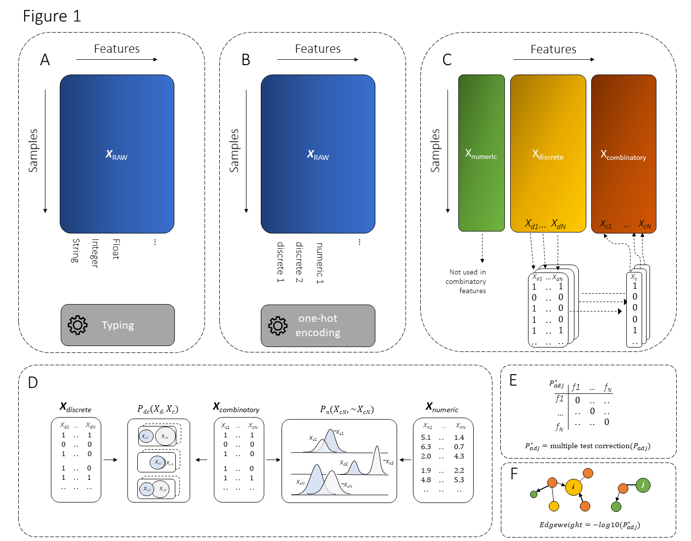

.. _code_directive:

-------------------------------------

Abstract
''''''''

Background
    Real-world data sets often contain measurements with both continues and categorical values for the same sample.
    Despite the availability of many libraries, data sets with mixed data types require intensive pre-processing steps, and it remains a challenge to describe the relationships of one variable on another.
    The data understanding part is crucial but without making any assumptions on the model form, the search space is super-exponential in the number of variables and therefore not a common practice.

Result
    We propose graphical hypergeometric networks (HNet), a method where associations across variables are tested for significance by statistical inference.
    The aim is to determine a network with significant associations that can shed light on the complex relationships across variables.
    HNet processes raw unstructured data sets and outputs a network that consists of (partially) directed or undirected edges between the nodes (i.e., variables).
    To evaluate the accuracy of HNet, we used well known data sets, and generated data sets with known ground truth by Bayesian sampling.
    In addition, the performance of HNet for the same data sets is compared to Bayesian structure learning.

Conclusions
    We demonstrate that HNet showed high accuracy and performance in the detection of node links.
    In the case of the Alarm data set we can demonstrate an average MCC score 0.33 + 0.0002 (P<1x10-6), whereas Bayesian structure learning showed an average MCC score of 0.52 + 0.006 (P<1x10-11), and randomly assigning edges resulted in a MCC score of 0.004 + 0.0003 (P=0.49).
    Although Bayesian structure learning showed slightly better results, HNet overcomes some of the limitations of existing methods as it processes raw unstructured data sets, it allows analysis of mixed data types, it easily scales up in number of variables, and allows detailed examination of the detected associations.

Availability
    The HNet library is built using Python v3.7 and contains various functionalities for pre-processing, setting dtypes, creating a one hot combinatoric array, associating testing, and interactive network creation. Code for HNet is available at https://github.com/erdogant/hnet or by: ``pip install hnet``, whereas for d3graph is available at https://github.com/erdogant/d3graph or by ``pip install d3graph``. Examples and detailed documentation for installation can be found on github. 

Key words
    hypergeometric test, structure learning, networks, unstructured data. 

Schematic overview
'''''''''''''''''''

The schematic overview of our approach is as following:

.. _schematic_overview:

