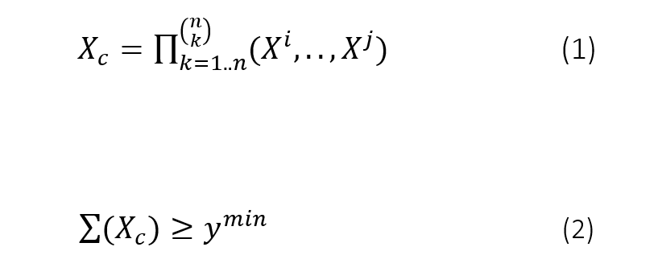
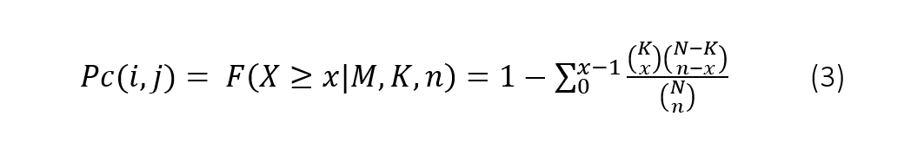
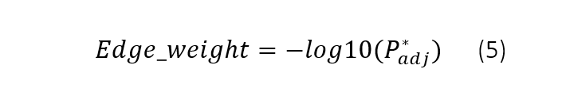

Pre-processing
''''''''''''''

To detect significant edge probabilities between pairs of vertices (node-links) given a data set, ``hnet`` consists a multi-step process that are described below.

Typing
''''''''''''''

The first step is pre-processing the data set by feature typing. In this step we type each feature as categoric, numeric or is excluded. The typing can be user-defined or automatically determined on conditions. In the latter case, features are set to numerical if values are floating type or have more than a minimum number of unique elements (e.g., if the number of unique elements >20% of the total non-missing). Features are set to categoric if values are boolean, integer or string.

One-hot Enconding
''''''''''''''''''

The second step is encoding the categoric values into a one-hot dense array. This is done using ``df2onehot``. The one-hot dense array is subsequently used to create combinatory features using k combinations over n features (without replacement, Figure 1C). The default k is set to 1, meaning that the input matrix (Xcategoric) is the same as combinatory matrix (Xcombination). When k>1, n boolean features are combined by multiplication for k unique combinations (eq.1). Each new combinatoric feature (Xc) is then added to the dense array.

Statistical inference
''''''''''''''''''''''''''''''

Each feature is examined on enrichment compared to another in the function :func:`hnet.hnet.enrichment`. To avoid high computational costs, mutual exclusive features are excluded, and features are excluded in case Xi contains less then ymin positive samples (default ymin=10, eq.2). 

.. table:: Equation 1 and 2
   :align: center

   +---------+
   ||eq_1_2| |
   +---------+

Hypergeometric test
^^^^^^^^^^^^^^^^^^^^^^^^^^^^^^^^ 

To assess significance with the categoric features (Xcategoric), the final dense array is tested for over-representation of successes in sample Xi by means of the hypergeometric distribution. The hypergeometric P-value between feature Xi and feature Xcj, is calculated as the probability of randomly drawing x or more successes from the population in n total draws with population size N containing K successes. For any Xi and Xcj, Pc(i,j) is computed as depicted in eq.3.

.. table:: Equation 3
   :align: center

   +---------+
   |  |eq_3| |
   +---------+

Wilcoxon Ranksum
^^^^^^^^^^^^^^^^^^^^^^^^^^^^^^^^ 

To assess significance across the numeric features (Xnumeric) in relation to the dense array (Xcombination) we utilized the Mann-Whitney-U test. Each numeric vector Xni, is split on categoric feature Xci versus ~Xci, and tested whether randomly selected value from Xci will be less than or greater than a randomly selected value from ~Xci.

Multiple testing
^^^^^^^^^^^^^^^^^^^^^^^^^^^^^^^^ 

All tested edge probabilities between pairs of vertices, either categoric-categoric or categoric-numeric, are stored in an adjacency matrix (Padj), and are corrected for multiple testing. The default Multiple Test Method (MTM) is set to Holm20 (Figure 1, equation 4) but optional are various other False Discovery Rate (FDR)18 or Familywise error rate (FWER)19 methods. 

.. |eq_4| image:: ../figs/other/eq_4.png
    :scale: 50%

.. table:: Equation 4
   :align: center

   +---------+
   |  |eq_4| |
   +---------+

The last step in HNet (Figure 1F) is declaring significance for node-links. An edge is called significant under alpha is 0.05 by default. The edge-weight is computed as depicted in equation 5.

.. table:: Equation 5
   :align: center

   +---------+
   |  |eq_5| |
   +---------+

The final output of HNet is an adjacency matrix containing edge weights that depicts the strength of pairs of vertices. The adjacency matrix can then be examined as a network representation using d3graph.

Enrichment
^^^^^^^^^^^^^^^^^^^^^^^^^^^^^^^^ 

An example of calculating hte enrichment is demonstrated below for a single response variable.

.. code-block:: python

  import hnet
  
  # Example dataset
  df = hn.import_example('titanic')

  # Set response variable y
  y = df['Survived'].values

  # Compute enrichment for input dataset df and y
  out = hnet.enrichment(df, y)

.. code-block:: python

	# [HNET] Start making fit..
	#
	# [DTYPES] Auto detecting dtypes
	# [DTYPES] [PassengerId] > [int]  ->[cat] [891]
	# [DTYPES] [Survived]    > [int]  ->[cat] [2]
	# [DTYPES] [Pclass]      > [int]  ->[cat] [3]
	# [DTYPES] [Name]        > [obj]  ->[cat] [891]
	# [DTYPES] [Sex]         > [obj]  ->[cat] [2]
	# [DTYPES] [Age]         > [float]->[num] [88]
	# [DTYPES] [SibSp]       > [int]  ->[cat] [7]
	# [DTYPES] [Parch]       > [int]  ->[cat] [7]
	# [DTYPES] [Ticket]      > [obj]  ->[cat] [681]
	# [DTYPES] [Fare]        > [float]->[num] [248]
	# [DTYPES] [Cabin]       > [obj]  ->[cat] [147]
	# [DTYPES] [Embarked]    > [obj]  ->[cat] [3]
	# [DTYPES] Setting dtypes in dataframe
	#
	# [HNET] Analyzing [cat] PassengerId.
	# [HNET] Analyzing [cat] Survived.
	# [HNET] Analyzing [cat] Pclass.
	# [HNET] Analyzing [cat] Name.
	# [HNET] Analyzing [cat] Sex.
	# [HNET] Analyzing [num] Age.
	# [HNET] Analyzing [cat] SibSp.
	# [HNET] Analyzing [cat] Parch.
	# [HNET] Analyzing [cat] Ticket.
	# [HNET] Analyzing [num] Fare.
	# [HNET] Analyzing [cat] Cabin.
	# [HNET] Analyzing [cat] Embarked.
	# [HNET] Multiple test correction using holm
	# [HNET] Fin

The output is a dataframe for which each row describes the feature and the columns the statistics belonging to it. By default, only significant features, i.e., `alpha<0.05` after multiple test correction are kept in the output.

.. output_enrichment:

.. figure:: ../figs/other/output_enrichment.png

As can been seen from the results, the most significant feature is *Survived* as shown in the `category_name` and `P` value. This is as expected as we used this variable as the response variable. The description of the output variables can be found here: :func:`hnet.hnet.enrichment`

black/white listing
''''''''''''''''''''''''''''''

Input variables (column names) can be black or white listed in the model.
When variables are black listed, they are excluded from the search and the resulting model will not contain any of those edges. If variables are white listed, the search is limited to only those edges. The resulting model will then only contain edges that are in white_list.

White listing
^^^^^^^^^^^^^^^^^^^^^^^^^^^^^^^

.. code-block:: python

  from hnet import hnet
  hn = hnet(white_list=['Survived', 'Pclass', 'Age', 'SibSp'])
  
  # Load data
  df = hn.import_example('titanic')
  
  # Association learning
  out = hn.association_learning(df)

Black listing
^^^^^^^^^^^^^^^^^^^^^^^^^^^^^^^

.. code-block:: python

  from hnet import hnet
  hn = hnet(black_list=['Survived', 'Pclass', 'Age', 'SibSp'])
  
  # Load data
  df = hn.import_example('titanic')
  
  # Association learning
  out = hn.association_learning(df)

Four methods of filtering are possible in ``hnet``

    * black_list : Excluded nodes form the plot. The resulting plot will not contain this node(s).
    * white_list : Only included the listed nodes in the plot. The resulting plot will be limited to the specified node(s).
    * threshold : Associations (edges) are filtered based on the -log10(P) > threshold. threshold should range between 0 and maximum value of -log10(P).
    * min_edges : Nodes are only shown if it contains at least a minimum number of edges.

.. include:: add_bottom.add