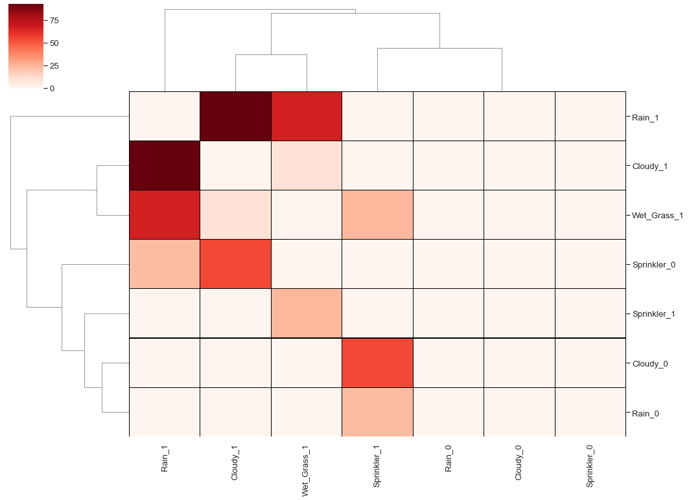

.. _code_directive:

-------------------------------------

Network Graphs
'''''''''''''''

Dynamic graph representations are created using ``d3graph`` that allow to deeper examine the detected associations. Just like static graphs, the dynamic graph consists out of nodes and edges for which sizes and colours are adjusted accordingly. 
The advantage is that d3graph is an interactive and stand-alone network. The network is created with collision and charge parameters to ensure that nodes do not overlap. 

d3graph is developed as a stand-alone python library (https://github.com/erdogant/d3graph) which generates java script based on a set of user-defined or ``hnet`` parameters. The java script file is built on functionalities from the d3 javascript library (version 3). 

.. code-block:: bash

  pip install d3graph

In its simplest form, the input for d3graph is an adjacency matrix for which the elements indicate pairs of vertices are adjacent or not in the graph.

.. table::
  
  +-----------+--------+-----------+--------+-----------+
  |           | Node 1 | Node 2    | Node 3 | Node 4    |
  +===========+========+===========+========+===========+
  | Node 1    | False  | True      | True   | False     |
  +-----------+--------+-----------+--------+-----------+
  | Node 2    | False  | False     | False  | True      |
  +-----------+--------+-----------+--------+-----------+
  | Node 3    | False  | False     | False  | True      |
  +-----------+--------+-----------+--------+-----------+
  | Node 4    | False  | False     | False  | False     |
  +-----------+--------+-----------+--------+-----------+

Integration of d3graph in hnet
^^^^^^^^^^^^^^^^^^^^^^^^^^^^^^

.. code-block:: python

  from hnet import hnet
  df = hnet.import_example('sprinkler')

  # Structure learning
  hn.association_learning(df)
  
  # Plot dynamic graph
  G_dynamic = hn.d3graph()

Each node contains a text-label, whereas the links of associated nodes can be highlighted when double clicked on the node of interest. Furthermore, each node involves a tooltip that can easily be adapted to display any of the underlying data. For deeper examination of the network, edges can be gradually broken on its weight using a slider. 

.. raw:: html

   <iframe src="https://erdogant.github.io/docs/d3graph/sprinkler_example/index.html" height="500px" width="1000px", frameBorder="0"></iframe>

Heatmap
'''''''

A heatmap can be of use when the results becomes too large to plot in a network.
Below is depicted a demonstration of plotting the results of ``hnet`` using a heatmap:

.. code-block:: python

  from hnet import hnet
  df = hnet.import_example('sprinkler')
  
  # Structure learning
  hn.association_learning(df)

  # Plot heatmap
  hn.heatmap(cluster=True)

.. _schematic_overview:

Comparing networks
''''''''''''''''''

Comparison of two networks based on two adjacency matrices. Both matrices should be of equal size and of type pandas DataFrame. The columns and rows between both matrices are matched if not ordered similarly.

Below is depicted a demonstration of comparing two networks that may have been the result of ``hnet`` using different parameter settings:

.. code-block:: python
  
  import hnet

  # Examine differences between models
  [scores, adjmat] = hnet.compare_networks(adjmat1, adjmat2)
