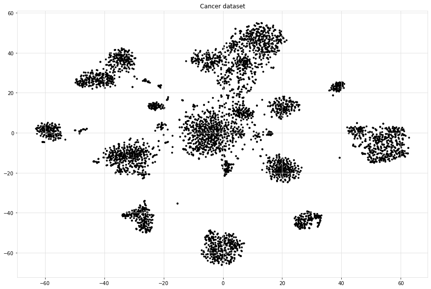
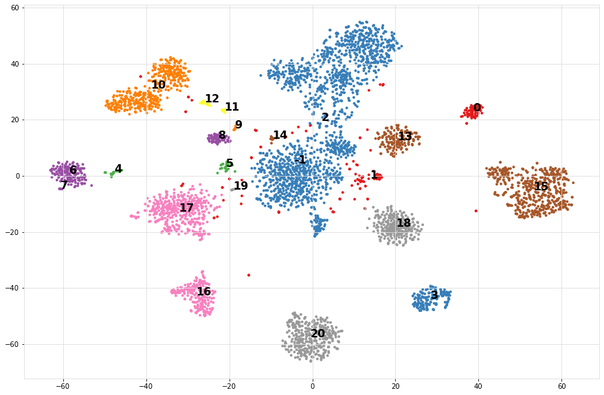
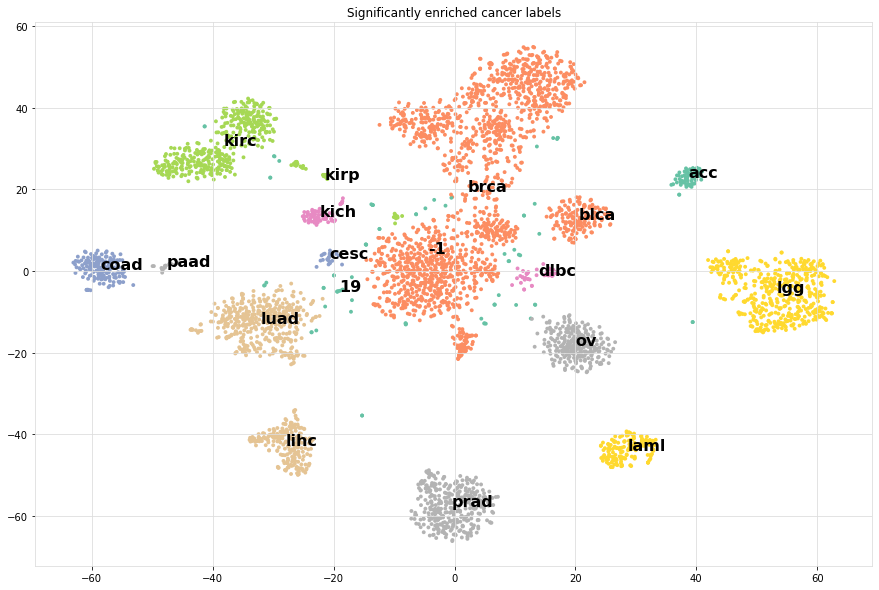

.. _code_directive:

-------------------------------------

Use Cases
-----------------

HNet can be used for all kind of datasets that contain features such as categorical, boolean, and/or continuous values.

    Your goal can be for example::
        1. Explore the complex associations between your variables using interactive networks.
        2. Determine an explanation for your clusters by enrichment.
        3. Transform your feature space and build a dissimilarity matrix that can be used for further analysis.

Cancer dataset
'''''''''''''''''''''

The cancer data set contains only a few columns but can result in an enormous complexity in their cross-relationships.
To unravel the associations between the variables, and gain insights, we can easily run ``hnet``. This dataset already contains tsne and PCA coordinates that we do not use. We will black list those to prevent being modeled.

.. code-block:: python
	
	# Import
	import hnet
	
	# Import example dataset
	df = hnet.import_example('cancer')
	
	# Print
	print(df.head())

	
.. table::

    +----+---------+---------+-------+--------+-------------------+-------------------+--------+---------+----------+
    |    |   tsneX |   tsneY |   age | sex    |   survival_months |   death_indicator | labx   |     PC1 |      PC2 |
    +====+=========+=========+=======+========+===================+===================+========+=========+==========+
    |  0 | 37.2043 | 24.1628 |    58 | male   |           44.5175 |                 0 | acc    | 49.2335 | 14.4965  |
    +----+---------+---------+-------+--------+-------------------+-------------------+--------+---------+----------+
    |  1 | 37.0931 | 23.4236 |    44 | female |           55.0965 |                 0 | acc    | 46.328  | 14.4645  |
    +----+---------+---------+-------+--------+-------------------+-------------------+--------+---------+----------+
    |  2 | 36.8063 | 23.4449 |    23 | female |           63.8029 |                 1 | acc    | 46.5679 | 13.4801  |
    +----+---------+---------+-------+--------+-------------------+-------------------+--------+---------+----------+
    |  3 | 38.0679 | 24.4118 |    30 | male   |           11.9918 |                 0 | acc    | 63.6247 |  1.87406 |
    +----+---------+---------+-------+--------+-------------------+-------------------+--------+---------+----------+
    |  4 | 36.7912 | 21.7153 |    29 | female |           79.77   |                 1 | acc    | 41.7467 | 37.5336  |
    +----+---------+---------+-------+--------+-------------------+-------------------+--------+---------+----------+

     
.. code-block:: python
	
	# Import
	from hnet import hnet
	
	# Initialize
	hn = hnet(black_list=['tsneX','tsneY','PC1','PC2'])

	# Learn the relationships
	results = hn.association_learning(df)

**Output looks as following**

.. code-block:: python

    # [hnet] >Removing features from the black list..
    # [DTYPES] Auto detecting dtypes
    # [DTYPES] [age]             > [float]->[num] [74]
    # [DTYPES] [sex]             > [obj]  ->[cat] [2]
    # [DTYPES] [survival_months] > [force]->[num] [1591]
    # [DTYPES] [death_indicator] > [float]->[num] [2]
    # [DTYPES] [labx]            > [obj]  ->[cat] [19]
    # [DTYPES] Setting dtypes in dataframe
    # [DF2ONEHOT] Working on age
    # [DF2ONEHOT] Working on sex.....[3]
    # [DF2ONEHOT] Working on survival_months
    # [DF2ONEHOT] Working on labx.....[19]
    # [DF2ONEHOT] Total onehot features: 22
    # [hnet] >Association learning across [22] categories.
    # 100%|██████████| 22/22 [00:07<00:00,  2.77it/s]
    # [hnet] >Total number of computations: [969]
    # [hnet] >Multiple test correction using holm
    # [hnet] >Dropping age
    # [hnet] >Dropping survival_months
    # [hnet] >Dropping death_indicator
    # [hnet] >Fin.

**Antecedents and Consequents**

If A implies C, then A is called the antecedent and C is called the consequent.
For the cancer data set we computed the antecedent and its consequent.
Here we can see that the strongest antecedents are BRCA: Breast cancer, CESC: Cervical squamous cell carcinoma, and OV: Ovarian Cancer, implies to the gender Female.
A Fishers Pvalue is detected of 0 (because of floating precision error.)
The second most significant hit is that females, and death indicator=1 implies to Breast cancer cases.

.. code-block:: python
	
	# Import example dataset
	print(hn.results['rules'])

.. table::

    +----+--------------------------------------------------------------------------------------------------------------------------+---------------+--------------+
    |    | antecedents                                                                                                              | consequents   |      Pfisher |
    +====+==========================================================================================================================+===============+==============+
    |  0 | ['labx_brca', 'labx_cesc', 'labx_ov', 'age_low_58', 'survival_months_low_13.8']                                          | sex_female    | 0            |
    +----+--------------------------------------------------------------------------------------------------------------------------+---------------+--------------+
    |  1 | ['sex_female', 'death_indicator_low_1']                                                                                  | labx_brca     | 4.05787e-210 |
    +----+--------------------------------------------------------------------------------------------------------------------------+---------------+--------------+
    |  2 | ['sex_male', 'death_indicator_low_1']                                                                                    | labx_prad     | 3.73511e-104 |
    +----+--------------------------------------------------------------------------------------------------------------------------+---------------+--------------+
    |  3 | ['sex_female', 'death_indicator_low_0', 'survival_months_low_29']                                                        | labx_ov       | 4.24764e-100 |
    +----+--------------------------------------------------------------------------------------------------------------------------+---------------+--------------+
    |  4 | ['labx_blca', 'labx_coad', 'labx_hnsc', 'labx_kirc', 'labx_kirp', 'labx_prad', 'age_low_61', 'survival_months_low_10.8'] | sex_male      | 7.99303e-93  |
    +----+--------------------------------------------------------------------------------------------------------------------------+---------------+--------------+
    

.. code-block:: python

	# Generate the interactive graph.
	G = hn.d3graph()

.. raw:: html

   <iframe src="https://erdogant.github.io/docs/d3graph/cancer/defaults/index.html" height="600px" width="100%", frameBorder="0"></iframe>

.. code-block:: python

	# Generate the interactive graph but color on clusters.
	G = hn.d3graph(node_color='cluster')

.. raw:: html

   <iframe src="https://erdogant.github.io/docs/d3graph/cancer/node_color/index.html" height="600px" width="100%", frameBorder="0"></iframe>

.. code-block:: python

	# Filter using white_list
	G = hn.d3graph(node_color='cluster', white_list=['labx','survival_months'])

.. raw:: html

   <iframe src="https://erdogant.github.io/docs/d3graph/cancer/white_list/" height="600px" width="100%", frameBorder="0"></iframe>

Fifa dataset
'''''''''''''''''''''

The Fifa data set is from 2018 and contains many variables. By default, many variables would be converted to categorical values which may not be the ideal choice.
We will set the dtypes manually to make sure each variable has the correct dtype.

.. code-block:: python

	# Import
	import hnet

	# Import example dataset
	df = hnet.import_example('fifa')
	
	# Print
	print(df.head())

.. table::

    +----+------------+--------------+--------------+---------------+---------------------+------------+-------------+--------------+-----------+-----------+------------+--------------+---------+-------------------+----------+--------------------------+-------------------+---------------+----------------+-------+--------------------+------------+-------------+-------+----------------+-------------+-----------------+
    |    | Date       | Team         | Opponent     |   Goal Scored |   Ball Possession % |   Attempts |   On-Target |   Off-Target |   Blocked |   Corners |   Offsides |   Free Kicks |   Saves |   Pass Accuracy % |   Passes |   Distance Covered (Kms) |   Fouls Committed |   Yellow Card |   Yellow & Red |   Red | Man of the Match   |   1st Goal | Round       | PSO   |   Goals in PSO |   Own goals |   Own goal Time |
    +====+============+==============+==============+===============+=====================+============+=============+==============+===========+===========+============+==============+=========+===================+==========+==========================+===================+===============+================+=======+====================+============+=============+=======+================+=============+=================+
    |  0 | 14-06-2018 | Russia       | Saudi Arabia |             5 |                  40 |         13 |           7 |            3 |         3 |         6 |          3 |           11 |       0 |                78 |      306 |                      118 |                22 |             0 |              0 |     0 | Yes                |         12 | Group Stage | No    |              0 |         nan |             nan |
    +----+------------+--------------+--------------+---------------+---------------------+------------+-------------+--------------+-----------+-----------+------------+--------------+---------+-------------------+----------+--------------------------+-------------------+---------------+----------------+-------+--------------------+------------+-------------+-------+----------------+-------------+-----------------+
    |  1 | 14-06-2018 | Saudi Arabia | Russia       |             0 |                  60 |          6 |           0 |            3 |         3 |         2 |          1 |           25 |       2 |                86 |      511 |                      105 |                10 |             0 |              0 |     0 | No                 |        nan | Group Stage | No    |              0 |         nan |             nan |
    +----+------------+--------------+--------------+---------------+---------------------+------------+-------------+--------------+-----------+-----------+------------+--------------+---------+-------------------+----------+--------------------------+-------------------+---------------+----------------+-------+--------------------+------------+-------------+-------+----------------+-------------+-----------------+
    |  2 | 15-06-2018 | Egypt        | Uruguay      |             0 |                  43 |          8 |           3 |            3 |         2 |         0 |          1 |            7 |       3 |                78 |      395 |                      112 |                12 |             2 |              0 |     0 | No                 |        nan | Group Stage | No    |              0 |         nan |             nan |
    +----+------------+--------------+--------------+---------------+---------------------+------------+-------------+--------------+-----------+-----------+------------+--------------+---------+-------------------+----------+--------------------------+-------------------+---------------+----------------+-------+--------------------+------------+-------------+-------+----------------+-------------+-----------------+
    |  3 | 15-06-2018 | Uruguay      | Egypt        |             1 |                  57 |         14 |           4 |            6 |         4 |         5 |          1 |           13 |       3 |                86 |      589 |                      111 |                 6 |             0 |              0 |     0 | Yes                |         89 | Group Stage | No    |              0 |         nan |             nan |
    +----+------------+--------------+--------------+---------------+---------------------+------------+-------------+--------------+-----------+-----------+------------+--------------+---------+-------------------+----------+--------------------------+-------------------+---------------+----------------+-------+--------------------+------------+-------------+-------+----------------+-------------+-----------------+
    |  4 | 15-06-2018 | Morocco      | Iran         |             0 |                  64 |         13 |           3 |            6 |         4 |         5 |          0 |           14 |       2 |                86 |      433 |                      101 |                22 |             1 |              0 |     0 | No                 |        nan | Group Stage | No    |              0 |           1 |              90 |
    +----+------------+--------------+--------------+---------------+---------------------+------------+-------------+--------------+-----------+-----------+------------+--------------+---------+-------------------+----------+--------------------------+-------------------+---------------+----------------+-------+--------------------+------------+-------------+-------+----------------+-------------+-----------------+

     
.. code-block:: python
	
	# Import
	from hnet import hnet
	
	# Initialize
	hn = hnet(dtypes=['None', 'cat', 'cat', 'cat', 'num', 'num', 'num', 'num', 'num', 'num', 'num', 'num', 'num', 'num', 'num', 'num', 'cat', 'cat', 'cat', 'cat', 'cat', 'cat', 'cat', 'cat', 'cat', 'cat', 'num'])

	# Learn the relationships
	results = hn.association_learning(df)

**Output looks as following**

.. code-block:: python

    # [DTYPES] Setting dtypes in dataframe
    # [DTYPES] [Date] [list] is used in dtyping!
    # [DF2ONEHOT] Working on Date.....[25]
    # [DF2ONEHOT] Working on Team.....[32]
    # [DF2ONEHOT] Working on Opponent.....[32]
    # [DF2ONEHOT] Working on Goal Scored.....[7]
    # [DF2ONEHOT] Working on Ball Possession %
    # [DF2ONEHOT] Working on Attempts
    # [DF2ONEHOT] Working on On-Target
    # [DF2ONEHOT] Working on Off-Target
    # [DF2ONEHOT] Working on Blocked
    # [DF2ONEHOT] Working on Corners
    # [DF2ONEHOT] Working on Offsides
    # [DF2ONEHOT] Working on Free Kicks
    # [DF2ONEHOT] Working on Saves
    # [DF2ONEHOT] Working on Pass Accuracy %
    # [DF2ONEHOT] Working on Passes
    # [DF2ONEHOT] Working on Distance Covered (Kms)
    # [DF2ONEHOT] Working on Fouls Committed.....[21]
    # [DF2ONEHOT] Working on Yellow Card.....[7]
    # [DF2ONEHOT] Working on Yellow & Red.....[2]
    # [DF2ONEHOT] Working on Red.....[2]
    #   0%|          | 0/24 [00:00<?, ?it/s][DF2ONEHOT] Working on Man of the Match.....[2]
    # [DF2ONEHOT] Working on 1st Goal.....[57]
    # [DF2ONEHOT] Working on Round.....[6]
    # [DF2ONEHOT] Working on PSO.....[2]
    # [DF2ONEHOT] Working on Goals in PSO.....[4]
    # [DF2ONEHOT] Working on Own goals.....[2]
    # [DF2ONEHOT] Working on Own goal Time
    # [DF2ONEHOT] Total onehot features: 24
    # [hnet] >Association learning across [24] categories.
    # 100%|██████████| 24/24 [00:22<00:00,  1.08it/s]
    # [hnet] >Total number of computations: [5240]
    # [hnet] >Multiple test correction using holm
    # [hnet] >Dropping 1st Goal
    # [hnet] >Dropping Own goals
    # [hnet] >Dropping Own goal Time
    # [hnet] >Fin.

**Antecedents and Consequents**

The conclusions are mostly about who/what was not doing so well during the matches.
So a lot of information can be used for improvement of matches. So if you are not **the man of the match**, you will likely have **0 goals**. 
It seems that football is not so complicated after all ;)

.. code-block:: python
	
	# Import example dataset
	print(hn.results['rules'])

.. table::

    +----+---------------------------------------------------+---------------------------------------------------------------------------+---------------------+-------------+
    |    | antecedents_labx                                  | antecedents                                                               | consequents         |     Pfisher |
    +====+===================================================+===========================================================================+=====================+=============+
    |  1 | ['Round' 'Goals in PSO' 'Distance Covered (Kms)'] | ['Round_Group Stage', 'Goals in PSO_0', 'Distance Covered (Kms)_low_104'] | PSO_No              | 7.60675e-11 |
    +----+---------------------------------------------------+---------------------------------------------------------------------------+---------------------+-------------+
    |  2 | ['Round' 'PSO' 'Distance Covered (Kms)']          | ['Round_Group Stage', 'PSO_No', 'Distance Covered (Kms)_low_104']         | Goals in PSO_0      | 7.60675e-11 |
    +----+---------------------------------------------------+---------------------------------------------------------------------------+---------------------+-------------+
    |  3 | ['Man of the Match']                              | ['Man of the Match_No']                                                   | Goal Scored_0       | 1.68161e-06 |
    +----+---------------------------------------------------+---------------------------------------------------------------------------+---------------------+-------------+
    |  4 | ['Goal Scored']                                   | ['Goal Scored_0']                                                         | Man of the Match_No | 1.68161e-06 |
    +----+---------------------------------------------------+---------------------------------------------------------------------------+---------------------+-------------+
    |  5 | ['PSO' 'Goals in PSO']                            | ['PSO_No', 'Goals in PSO_0']                                              | Round_Group Stage   | 0.00195106  |
    +----+---------------------------------------------------+---------------------------------------------------------------------------+---------------------+-------------+ 

Create the network graph. Im not entirely sure what to say about this. Draw your own conclusions ;)

.. code-block:: python

	# Generate the interactive graph.
	G = hn.d3graph()

.. raw:: html

   <iframe src="https://erdogant.github.io/docs/d3graph/fifa_2018/" height="600px" width="100%", frameBorder="0"></iframe>

Cluster enrichment
'''''''''''''''''''''

In case you have detected cluster labels and now you want to know whether there is association between any of the clusters with a (group of) feature(s).
In this example, I will load an cancer data set with pre-computed t-SNE coordinates based on genomic profiles. The t-SNE coordinates I will cluster, and the detected labels are used to determine any assocation with the metadata.

.. code-block:: bash
	
	# For cluster evaluation
	pip install sklearn
	# For easy plotting
	pip install scatterd

.. code-block:: python
	
	# Import
	import hnet
	# Import example dataset
	df = hnet.import_example('cancer')
	# Print
	print(df.head())

.. table::

    +----+---------+---------+-------+--------+-------------------+-------------------+--------+---------+----------+
    |    |   tsneX |   tsneY |   age | sex    |   survival_months |   death_indicator | labx   |     PC1 |      PC2 |
    +====+=========+=========+=======+========+===================+===================+========+=========+==========+
    |  0 | 37.2043 | 24.1628 |    58 | male   |           44.5175 |                 0 | acc    | 49.2335 | 14.4965  |
    +----+---------+---------+-------+--------+-------------------+-------------------+--------+---------+----------+
    |  1 | 37.0931 | 23.4236 |    44 | female |           55.0965 |                 0 | acc    | 46.328  | 14.4645  |
    +----+---------+---------+-------+--------+-------------------+-------------------+--------+---------+----------+
    |  2 | 36.8063 | 23.4449 |    23 | female |           63.8029 |                 1 | acc    | 46.5679 | 13.4801  |
    +----+---------+---------+-------+--------+-------------------+-------------------+--------+---------+----------+
    |  3 | 38.0679 | 24.4118 |    30 | male   |           11.9918 |                 0 | acc    | 63.6247 |  1.87406 |
    +----+---------+---------+-------+--------+-------------------+-------------------+--------+---------+----------+
    |  4 | 36.7912 | 21.7153 |    29 | female |           79.77   |                 1 | acc    | 41.7467 | 37.5336  |
    +----+---------+---------+-------+--------+-------------------+-------------------+--------+---------+----------+

For demonstration purposes, we make a scatter plot with the True cancer labels to show that cancer labels are associated with the clusters.
In many use-cases you want to determine which variables fit best with the computed cluster labels.

.. code-block:: python

    # Import
    from scatterd import scatterd
    # Make scatter plot
    scatterd(df['tsneX'],df['tsneY'], label=df['labx'], cmap='Set2', fontcolor=[0,0,0], title='Cancer dataset with True labels')
    # Make scatter plot wihtout colors
    scatterd(df['tsneX'],df['tsneY'], title='Cancer dataset.')

.. |fig1| image:: ../figs/other/cancer_scatter.png
    :scale: 90%

.. table:: tSNE scatter plot of Cancer patients.
   :align: center

   +---------+---------+
   | |fig1|  | |fig2|  |
   +---------+---------+

Step 1 is to compute the cluster labels based on the tSNE coordinates. 
Step 2 is to compute the enrichment of the variables (meta-data) with the cluster labels.

.. code-block:: python
	
	# Import
	import sklearn
	import hnet
	
	# Determine cluster labels
	dbscan = sklearn.cluster.DBSCAN(eps=2)
	labx = dbscan.fit_predict(df[['tsneX','tsneY']])
	print('Number of detected clusters: %d' %(len(np.unique(labx))))
	# Number of detected clusters: 22

	# Enrichment of clusterlabels with the meta-data
	# results = hnet.enrichment(df[['age', 'sex', 'survival_months', 'death_indicator','labx']], labx)

	# [hnet] >Start making fit..
	# [df2onehot] >Auto detecting dtypes
	# [df2onehot] >[age]			 > [float] > [num] [74]
	# [df2onehot] >[sex]			 > [obj]   > [cat] [2]
	# [df2onehot] >[survival_months] > [force] > [num] [1591]
	# [df2onehot] >[death_indicator] > [float] > [num] [2]
	# [df2onehot] >[labx]			 > [obj]   > [cat] [19]
	# [df2onehot] >
	# [df2onehot] >Setting dtypes in dataframe
	# [hnet] >Analyzing [num] age......................
	# [hnet] >Analyzing [cat] sex......................
	# [hnet] >Analyzing [num] survival_months......................
	# [hnet] >Analyzing [num] death_indicator......................
	# [hnet] >Analyzing [cat] labx......................
	# [hnet] >Multiple test correction using holm
	# [hnet] >Fin
	
	# For demonstration purposes I will only do the true cancer label column.
	results = hnet.enrichment(df[['labx']], labx)

	# Examine the results
	print(results)

When we look at the results, we see in the first column the *category_label*. These are the metadata variables *df* that we gave as an input.
The second columns: *P* stands for P-value, which is the computed significance of the catagory_label with the target variable *y*. In our case these are are the cluster labels *labx*.
A disadvantage of the P value is the limitation of machine precision. This may end up with P-value of 0. The logP is more interesting as these are not capped by machine precision (lower is better).
Note that the target labels in *y* can be seen more then once. This means that certain *y* are enriched for multiple variables. In our case this can occur because we may need to better estimate the cluster labels.

.. table::

    +----+------------------+--------------+------------+-------------+-------------+-------------------+----------------+-------------+-----+-----------------+--------------+
    |    | category_label   |            P |       logP |   overlap_X |   popsize_M |   nr_succes_pop_n |   samplesize_N | dtype       |   y | category_name   |         Padj |
    +====+==================+==============+============+=============+=============+===================+================+=============+=====+=================+==============+
    |  0 | acc              | 1.27018e-153 |  -352.056  |          71 |        4674 |                77 |             72 | categorical |   0 | labx            | 5.15692e-151 |
    +----+------------------+--------------+------------+-------------+-------------+-------------------+----------------+-------------+-----+-----------------+--------------+
    |  1 | dlbc             | 3.22319e-51  |  -116.261  |          24 |        4674 |                27 |             48 | categorical |   1 | labx            | 1.29572e-48  |
    +----+------------------+--------------+------------+-------------+-------------+-------------------+----------------+-------------+-----+-----------------+--------------+
    |  2 | kirc             | 4.73559e-219 |  -502.711  |         218 |        4674 |               259 |            398 | categorical |  10 | labx            | 1.94633e-216 |
    +----+------------------+--------------+------------+-------------+-------------+-------------------+----------------+-------------+-----+-----------------+--------------+
    |  3 | kirp             | 2.12553e-166 |  -381.475  |         177 |        4674 |               219 |            398 | categorical |  10 | labx            | 8.65091e-164 |
    +----+------------------+--------------+------------+-------------+-------------+-------------------+----------------+-------------+-----+-----------------+--------------+
    |  4 | kirc             | 8.16897e-20  |   -43.9514 |          15 |        4674 |               259 |             17 | categorical |  11 | labx            | 3.24308e-17  |
    +----+------------------+--------------+------------+-------------+-------------+-------------------+----------------+-------------+-----+-----------------+--------------+
    |  5 | kirp             | 1.26634e-20  |   -45.8156 |          18 |        4674 |               219 |             26 | categorical |  12 | labx            | 5.04005e-18  |
    +----+------------------+--------------+------------+-------------+-------------+-------------------+----------------+-------------+-----+-----------------+--------------+
    |  6 | blca             | 5.65247e-217 |  -497.929  |         157 |        4674 |               265 |            161 | categorical |  13 | labx            | 2.31751e-214 |
    +----+------------------+--------------+------------+-------------+-------------+-------------------+----------------+-------------+-----+-----------------+--------------+
    |  7 | kirp             | 4.18004e-14  |   -30.8059 |           9 |        4674 |               219 |             10 | categorical |  14 | labx            | 1.6553e-11   |
    +----+------------------+--------------+------------+-------------+-------------+-------------------+----------------+-------------+-----+-----------------+--------------+
    |  8 | lgg              | 0            | -1571.11   |         500 |        4674 |               504 |            501 | categorical |  15 | labx            | 0            |
    +----+------------------+--------------+------------+-------------+-------------+-------------------+----------------+-------------+-----+-----------------+--------------+
    |  9 | lihc             | 0            |  -841.979  |         220 |        4674 |               231 |            222 | categorical |  16 | labx            | 0            |
    +----+------------------+--------------+------------+-------------+-------------+-------------------+----------------+-------------+-----+-----------------+--------------+
    | 10 | luad             | 0            | -1172.91   |         397 |        4674 |               427 |            419 | categorical |  17 | labx            | 0            |
    +----+------------------+--------------+------------+-------------+-------------+-------------------+----------------+-------------+-----+-----------------+--------------+
    | 11 | ov               | 0            |  -963.047  |         256 |        4674 |               262 |            258 | categorical |  18 | labx            | 0            |
    +----+------------------+--------------+------------+-------------+-------------+-------------------+----------------+-------------+-----+-----------------+--------------+
    | 12 | brca             | 0            |  -846.29   |         745 |        4674 |               761 |           1653 | categorical |   2 | labx            | 0            |
    +----+------------------+--------------+------------+-------------+-------------+-------------------+----------------+-------------+-----+-----------------+--------------+
    | 13 | cesc             | 1.49892e-49  |  -112.422  |         172 |        4674 |               205 |           1653 | categorical |   2 | labx            | 5.99569e-47  |
    +----+------------------+--------------+------------+-------------+-------------+-------------------+----------------+-------------+-----+-----------------+--------------+
    | 14 | hnsc             | 1.9156e-212  |  -487.498  |         463 |        4674 |               474 |           1653 | categorical |   2 | labx            | 7.83481e-210 |
    +----+------------------+--------------+------------+-------------+-------------+-------------------+----------------+-------------+-----+-----------------+--------------+
    | 15 | lusc             | 6.20884e-51  |  -115.606  |         159 |        4674 |               182 |           1653 | categorical |   2 | labx            | 2.48975e-48  |
    +----+------------------+--------------+------------+-------------+-------------+-------------------+----------------+-------------+-----+-----------------+--------------+
    | 16 | prad             | 0            | -1241.55   |         356 |        4674 |               360 |            357 | categorical |  20 | labx            | 0            |
    +----+------------------+--------------+------------+-------------+-------------+-------------------+----------------+-------------+-----+-----------------+--------------+
    | 17 | laml             | 4.39155e-312 |  -716.927  |         166 |        4674 |               167 |            167 | categorical |   3 | labx            | 1.80932e-309 |
    +----+------------------+--------------+------------+-------------+-------------+-------------------+----------------+-------------+-----+-----------------+--------------+
    | 18 | paad             | 2.14906e-54  |  -123.575  |          19 |        4674 |                20 |             21 | categorical |   4 | labx            | 8.6822e-52   |
    +----+------------------+--------------+------------+-------------+-------------+-------------------+----------------+-------------+-----+-----------------+--------------+
    | 19 | cesc             | 1.11451e-28  |   -64.364  |          21 |        4674 |               205 |             24 | categorical |   5 | labx            | 4.44688e-26  |
    +----+------------------+--------------+------------+-------------+-------------+-------------------+----------------+-------------+-----+-----------------+--------------+
    | 20 | coad             | 1.16815e-193 |  -444.244  |         122 |        4674 |               134 |            161 | categorical |   6 | labx            | 4.76605e-191 |
    +----+------------------+--------------+------------+-------------+-------------+-------------------+----------------+-------------+-----+-----------------+--------------+
    | 21 | read             | 4.83245e-52  |  -118.159  |          33 |        4674 |                34 |            161 | categorical |   6 | labx            | 1.94748e-49  |
    +----+------------------+--------------+------------+-------------+-------------+-------------------+----------------+-------------+-----+-----------------+--------------+
    | 22 | coad             | 3.71058e-13  |   -28.6224 |           7 |        4674 |               134 |              8 | categorical |   7 | labx            | 1.46568e-10  |
    +----+------------------+--------------+------------+-------------+-------------+-------------------+----------------+-------------+-----+-----------------+--------------+
    | 23 | kich             | 5.97831e-124 |  -283.732  |          59 |        4674 |                66 |             65 | categorical |   8 | labx            | 2.42122e-121 |
    +----+------------------+--------------+------------+-------------+-------------+-------------------+----------------+-------------+-----+-----------------+--------------+
    | 24 | kich             | 1.2301e-06   |   -13.6084 |           3 |        4674 |                66 |              7 | categorical |   9 | labx            | 0.00048466   |
    +----+------------------+--------------+------------+-------------+-------------+-------------------+----------------+-------------+-----+-----------------+--------------+

Lets compute for each cluster (y), the most significantly enriched category label.

.. code-block:: python

	from scatterd import scatterd

	# Import
	out = results.loc[results.groupby(by='y')['logP'].idxmin()]
	enriched_label = pd.DataFrame(labx.astype(str))

	for i in range(out.shape[0]):
		enriched_label = enriched_label.replace(out['y'].iloc[i], out['category_label'].iloc[i])

	# Scatterplot of the cluster numbers
	scatterd(df['tsneX'],df['tsneY'], label=labx, fontcolor=[0,0,0])
	# Scatterplot of the significantly enriched cancer labels
	scatterd(df['tsneX'],df['tsneY'], label=enriched_label.values.ravel(), fontcolor=[0,0,0], cmap='Set2', title='Significantly enriched cancer labels')

.. table:: Scatter plot of detected cluster and significantly enriched cancer labels for each of the clusters.
   :align: center

   +---------+---------+
   | |fig1|  | |fig2|  |
   +---------+---------+
   